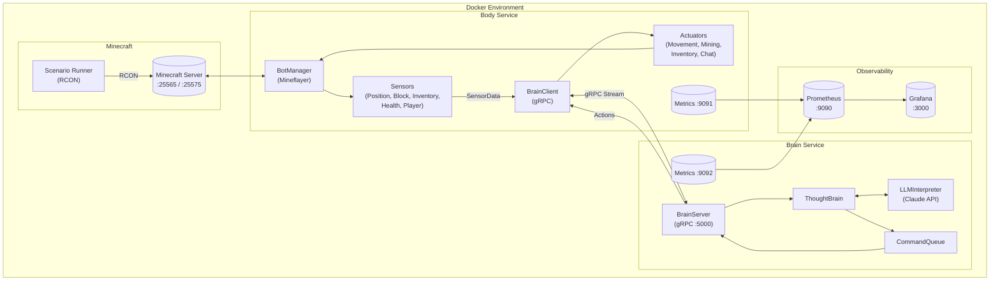
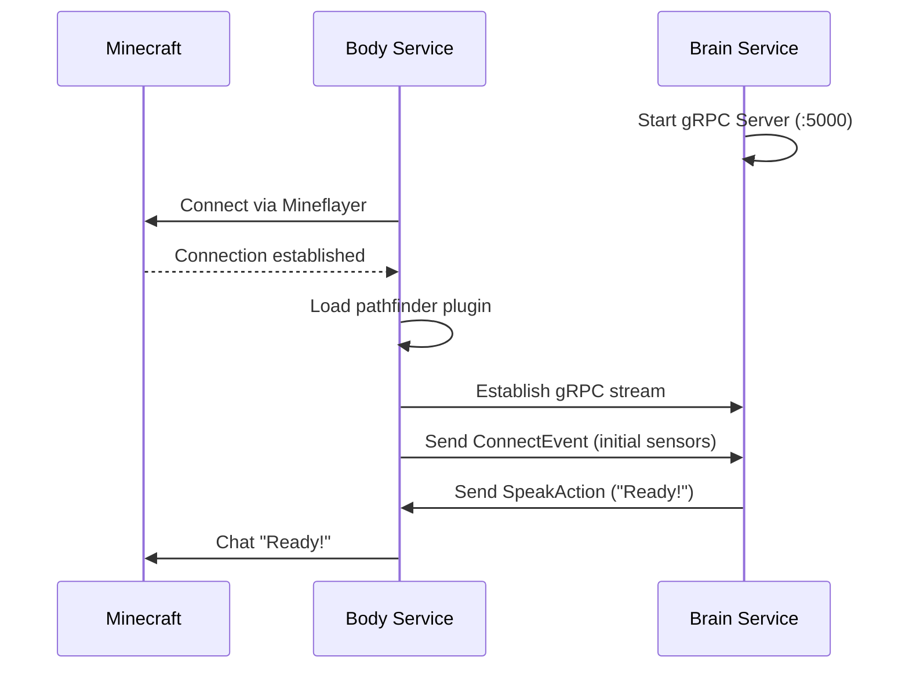
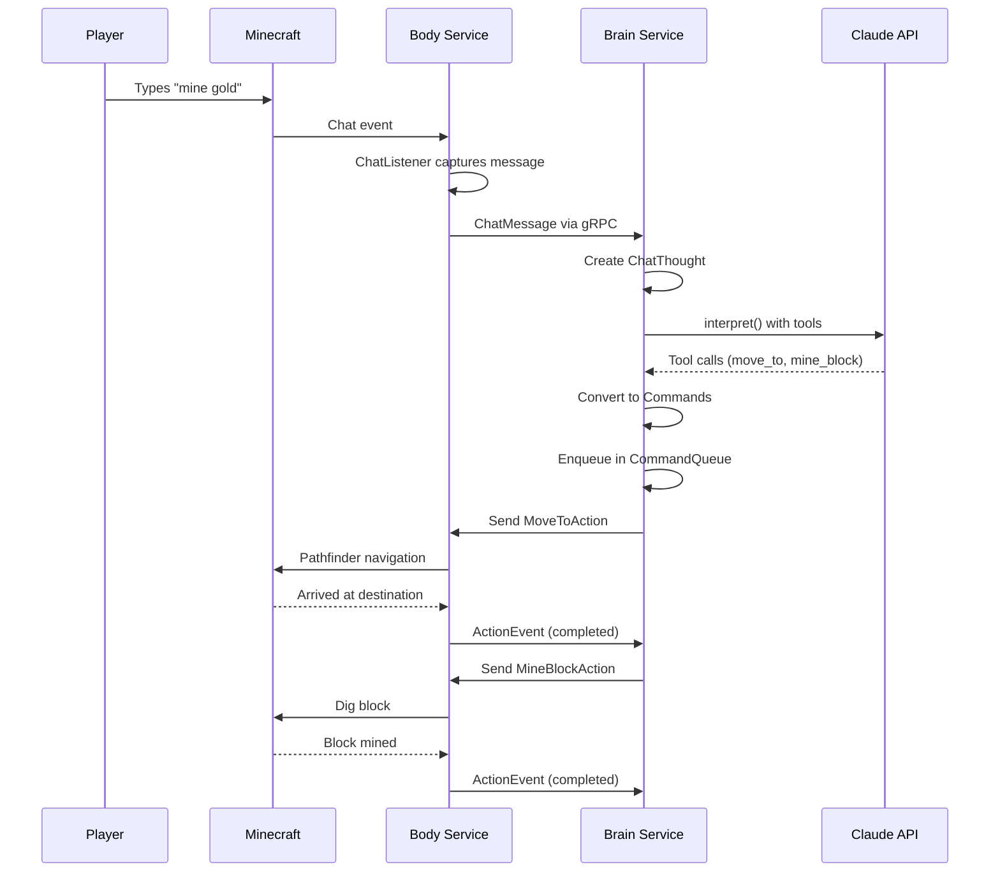
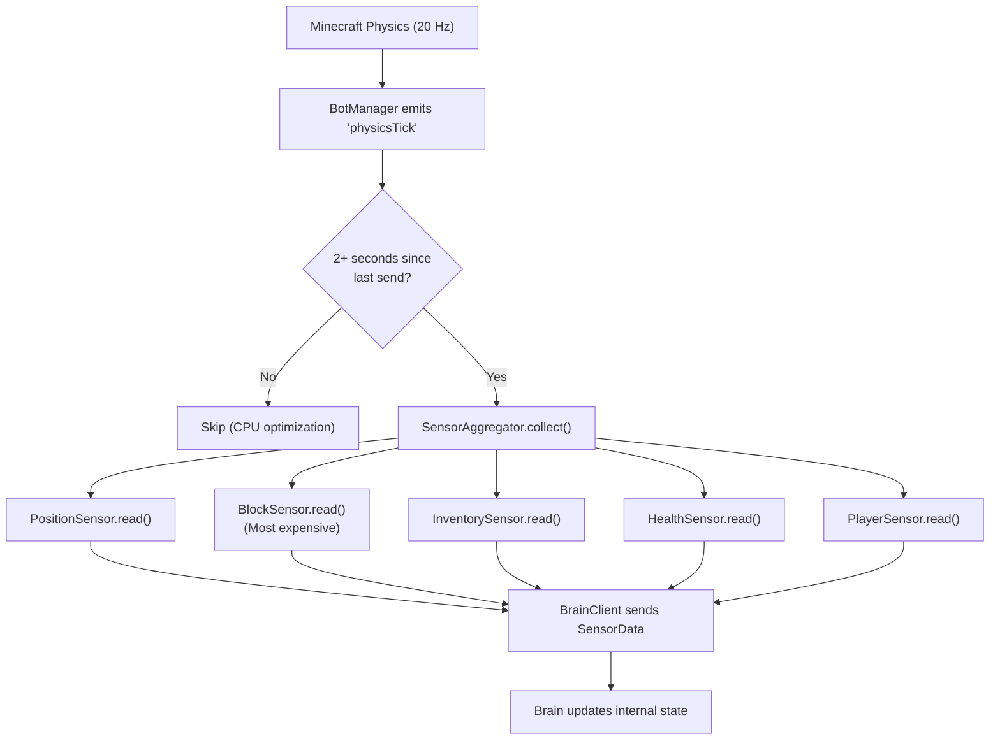
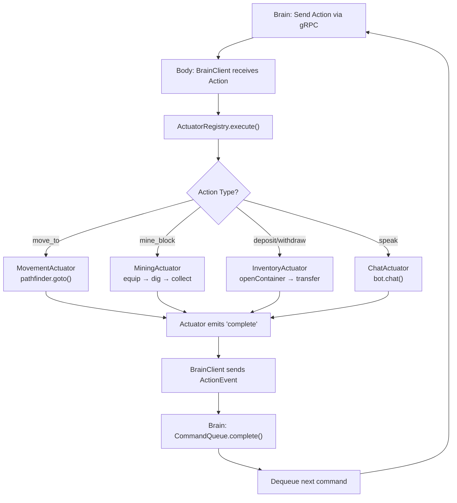

# Cubert Architecture

This document provides a comprehensive overview of Cubert's architecture, including component responsibilities, communication patterns, and design decisions.

## Table of Contents

- [Overview](#overview)
- [System Architecture](#system-architecture)
- [Component Details](#component-details)
  - [Body Service](#body-service)
  - [Brain Service](#brain-service)
  - [Protocol Buffers](#protocol-buffers)
- [Communication Patterns](#communication-patterns)
- [Data Flow](#data-flow)
- [Technology Stack](#technology-stack)
- [Design Decisions](#design-decisions)
- [Observability](#observability)
- [Scenario System](#scenario-system)

## Overview

Cubert is a modular Minecraft bot system designed with a clean separation between **perception/actuation** (Body) and **decision-making** (Brain). This architecture enables:

- **Independent scaling**: Brain and Body can be deployed and scaled separately
- **Swappable intelligence**: Different brain implementations (LLM, rule-based, ML) can be plugged in
- **Testability**: Each component can be tested in isolation
- **Real-time operation**: Bidirectional gRPC streaming enables low-latency sensor/action flow

## System Architecture



## Component Details

### Body Service

**Location**: `packages/body/`

The Body is Cubert's interface to the Minecraft world. It handles all perception (sensors) and actuation (movement, mining, inventory).

#### Sensors

Sensors collect data from the Minecraft world and package it for the Brain.

| Sensor | File | Responsibility |
|--------|------|----------------|
| **PositionSensor** | `src/sensors/PositionSensor.ts` | Bot location (x,y,z), rotation (yaw,pitch), ground status |
| **BlockSensor** | `src/sensors/BlockSensor.ts` | Nearby blocks of interest (gold, lava, chests, hazards) |
| **InventorySensor** | `src/sensors/InventorySensor.ts` | Inventory contents and selected slot |
| **HealthSensor** | `src/sensors/HealthSensor.ts` | Health, food, saturation, oxygen levels |
| **PlayerSensor** | `src/sensors/PlayerSensor.ts` | Nearby player positions (max 10) |

**Sensor Aggregation** (`src/sensors/index.ts`):
- Sensors are polled at 20Hz (physics tick rate)
- Data is only sent to Brain every 2000ms to reduce CPU load
- Forced sensor gather occurs after action completion

#### Actuators

Actuators execute actions commanded by the Brain.

| Actuator | File | Responsibility |
|----------|------|----------------|
| **MovementActuator** | `src/actuators/MovementActuator.ts` | Pathfinding with hazard avoidance |
| **MiningActuator** | `src/actuators/MiningActuator.ts` | Block mining, pickaxe equipping, drop collection |
| **InventoryActuator** | `src/actuators/InventoryActuator.ts` | Chest deposit/withdraw operations |
| **ChatActuator** | `src/actuators/ChatActuator.ts` | In-game chat messages |

#### Key Classes

- **BotManager** (`src/bot/BotManager.ts`): Manages Mineflayer connection, reconnection, pathfinder setup
- **SensorAggregator** (`src/sensors/index.ts`): Collects and throttles sensor data
- **ActuatorRegistry** (`src/actuators/index.ts`): Dispatches actions to appropriate actuator
- **BrainClient** (`src/grpc/client.ts`): gRPC client for Brain communication
- **ChatListener** (`src/chat/ChatListener.ts`): Monitors Minecraft chat for player commands

### Brain Service

**Location**: `packages/brain/`

The Brain processes thoughts (from chat, sensors, timers) and decides what actions to take using an LLM.

#### Core Components

| Component | File | Responsibility |
|-----------|------|----------------|
| **ThoughtBrain** | `src/brains/ThoughtBrain.ts` | Main brain implementation, orchestrates thought→action flow |
| **Thought** | `src/thought/Thought.ts` | Abstraction for different thought sources |
| **LLMInterpreter** | `src/llm/LLMInterpreter.ts` | Claude API integration with tool definitions |
| **ToolResolver** | `src/llm/ToolResolver.ts` | Resolves abstract targets to coordinates |
| **CommandQueue** | `src/command/CommandQueue.ts` | FIFO queue for sequential action execution |
| **BrainServer** | `src/grpc/server.ts` | gRPC server for Body connections |

#### LLM Tools

The Brain exposes these tools to Claude:

| Tool | Description |
|------|-------------|
| `speak` | Send chat messages in Minecraft |
| `move_to` | Navigate to a location (with optional urgent flag) |
| `mine_block` | Mine a specific block type |
| `deposit_items` | Put items in a nearby chest |
| `withdraw_items` | Take items from a chest |
| `stop` | Clear the command queue |
| `wait` | Idle for a duration |
| `remember` | Store a location in memory for later recall |

#### Movement Profiles

The Brain defines movement profiles that control pathfinding behavior:

```typescript
MOVEMENT_PROFILES = {
  safe: {
    hazards: { bufferDistance: 5, scanRadius: 32, scanCount: 10000 },
    locomotion: { canDig: true, allowParkour: false, allowSprinting: false }
  },
  unsafe: {
    hazards: { bufferDistance: 0, scanRadius: 0 },
    liquids: { treatAsAir: ['lava', 'flowing_lava'] }
  }
}
```

### Protocol Buffers

**Location**: `proto/cubert.proto`

Defines the gRPC service and message types for Brain-Body communication.

#### Service Definition

```protobuf
service BrainService {
  rpc Connect(stream BodyMessage) returns (stream Action);  // Bidirectional streaming
  rpc Ping(PingRequest) returns (PingResponse);             // Health check
}
```

#### Message Types

**Body → Brain**:
- `SensorData` - Position, inventory, health, nearby blocks, path status
- `ActionEvent` - Action started/completed/failed notification
- `ConnectEvent` - Body connected with initial sensor data
- `ChatMessage` - Player chat messages

**Brain → Body**:
- `MoveToAction` - Navigate with hazard/locomotion config
- `MineBlockAction` - Mine a specific block
- `DepositItemsAction` / `WithdrawItemsAction` - Chest operations
- `SpeakAction` - Chat message
- `IdleAction` - Wait for duration
- `CancelAction` - Cancel current action

## Communication Patterns

### Startup Sequence



### Chat Command Flow



## Data Flow

### Sensor Data Flow



### Action Execution Flow



## Technology Stack

### Languages & Runtime
- **TypeScript** 5.3+
- **Node.js** 20+
- **tsx** (development) / **tsc** (production build)

### Core Libraries

| Purpose | Library | Notes |
|---------|---------|-------|
| Minecraft Bot | `mineflayer` 4.20.0 | Bot connection, physics, items |
| Pathfinding | `mineflayer-pathfinder` 2.4.5 | A* navigation |
| gRPC | `@grpc/grpc-js` 1.10.0 | Bidirectional streaming |
| LLM | `@anthropic-ai/sdk` 0.39.0 | Claude API with tools |
| Metrics | `prom-client` 15.1.0 | Prometheus exposition |
| Logging | `pino` 10.3.0 | Structured JSON logging |

### Infrastructure
- **Docker** with multi-stage alpine builds
- **Docker Compose** for orchestration
- **Prometheus** for metrics collection
- **Grafana** for visualization
- **cAdvisor** for container metrics

## Design Decisions

### 1. Body/Brain Separation

**Why**: Clean separation of concerns enables:
- Testing perception and actuation independently
- Swapping brain implementations (LLM, ML, rule-based)
- Scaling brain horizontally for multiple bots
- Different deployment strategies (edge body, cloud brain)

### 2. Bidirectional gRPC Streaming

**Why gRPC over REST?**
- Real-time: Immediate action dispatch and sensor updates
- Efficient: Binary protocol, persistent connection
- Type-safe: Proto definitions enforce schema
- Backpressure: Natural flow control

### 3. Sensor Throttling

**Problem**: `BlockSensor.read()` calls `bot.findBlocks()` multiple times per tick, which is CPU-intensive.

**Solution**:
- Poll at physics tick rate (50ms)
- Only send to Brain every 2000ms
- Force gather on action completion
- Result: ~10x CPU reduction

### 4. Hazard Avoidance via BufferedMovements

The `MovementActuator` uses a custom `BufferedMovements` class that:
- Scans for hazard blocks (lava, fire)
- Creates a "danger zone" buffer around hazards
- Marks buffer positions as impassable to pathfinder
- Configurable via Brain's movement profiles

### 5. Sequential Command Queue

**Why one command at a time?**
- Prevents overlapping movement and mining
- Avoids inventory corruption
- Simplifies action completion tracking
- Enables reliable multi-step sequences

### 6. Location Memory

Simple in-memory map for remembered locations:
```typescript
rememberedLocations: Map<string, { x, y, z }>
```
Enables natural commands like "go to home" after "remember this as home".

## Observability

### Metrics

**Body Service** (`:9091/metrics`):
- `cubert_gold_mined_total` - Gold blocks mined
- `cubert_gold_inventory` - Gold in bot inventory
- `cubert_actions_total` - Actions by type/result
- `cubert_sensor_gathers_total` - Sensor collection count
- `cubert_bot_connected` - Connection status

**Brain Service** (`:9092/metrics`):
- `cubert_llm_calls_total` - Claude API calls
- `cubert_llm_latency_seconds` - API response time histogram
- `cubert_thoughts_processed_total` - Thoughts by source
- `cubert_commands_queued_total` - Commands by tool
- `cubert_command_queue_length` - Current queue depth

### Logging

Both services use Pino for structured JSON logging:
```json
{"level":30,"time":1234567890,"msg":"Mining gold ore at (10, 64, 5)"}
```

## Scenario System

Scenarios configure the Minecraft world for specific use cases.

**Location**: `scenarios/{name}/`

| File | Purpose |
|------|---------|
| `scenario.json` | Metadata (spawn, gamemode, world settings) |
| `setup.mcfunction` | Initial world setup commands |
| `spawn-resources.mcfunction` | Resource spawning loop |

**Example: semi-autonomous**
```json
{
  "name": "semi-autonomous",
  "minecraft": { "gamemode": "survival", "difficulty": "normal" },
  "spawn": { "x": -10, "y": 65, "z": 0 },
  "setup": { "commands": "setup.mcfunction" },
  "spawner": { "commands": "spawn-resources.mcfunction", "intervalMs": 30000 }
}
```

The **Scenario Runner** (`tools/scenario-runner/`):
- Connects via RCON
- Executes setup commands on boot
- Runs spawner commands on interval
- Equips bot with initial items
