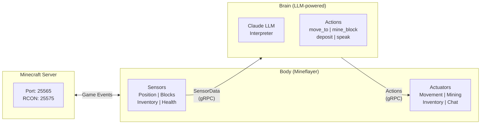

# Cubert

A modular Minecraft bot system with clean separation between perception/actuation (Body) and decision-making (Brain).

](https://www.youtube.com/watch?v=jbTugBI1GaI)

## A Platform for Trust and Governance Research

Cubert is a small, playful platform for studying the challenges involved in **Trust and Governance of autonomous systems**. By using Minecraft as an accessible, observable environment, Cubert provides a safe sandbox to explore questions like:

- **How do we trust an LLM-powered agent?** The bot interprets natural language commands and decides how to act. When should it ask for clarification vs. act autonomously?
- **What governance mechanisms work?** Movement profiles, hazard avoidance buffers, and command queues are all forms of constraints. How do we balance autonomy with safety?
- **How do we observe and audit behavior?** With full metrics, logging, and a visual Minecraft client, you can watch exactly what the agent does and why.
- **How do we handle failure gracefully?** Lava pits, lost connections, and ambiguous commands all test the system's robustness.

This makes Cubert ideal for workshops, demos, and exploratory research on autonomous agent behavior.

## Quick Start

### Prerequisites

- Docker and Docker Compose
- Node.js 20+ (for local development)
- Minecraft Java Edition 1.20.4 (optional, to observe the bot)
- `ANTHROPIC_API_KEY` environment variable set

### Run the Full Stack

```bash
# Clone and enter the repo
git clone https://github.com/your-org/cubert.git
cd cubert

# Set your API key
export ANTHROPIC_API_KEY=your-key-here

# Start all services
docker compose up --build
```

This starts:
- **Minecraft server** on port 25565 (RCON on 25575)
- **Brain service** - LLM-powered decision making (gRPC on 5000)
- **Body service** - Mineflayer bot with sensors and actuators
- **Scenario runner** - Sets up the world and spawns resources
- **Prometheus + Grafana** - Metrics and dashboards

### Observe the Bot

1. Open Minecraft Java Edition 1.20.4
2. Multiplayer → Add Server → `localhost:25565`
3. Join the game and find Cubert
4. Chat commands like `mine gold`, `go to chest`, or `stop` to interact

### View Metrics

- **Grafana**: http://localhost:3000 (admin/admin)
- **Prometheus**: http://localhost:9090
- **Body metrics**: http://localhost:9091/metrics
- **Brain metrics**: http://localhost:9092/metrics

## Architecture Overview



For detailed architecture documentation including component internals, data flows, and design decisions, see **[ARCHITECTURE.md](ARCHITECTURE.md)**.

## Project Structure

```
cubert/
├── proto/
│   └── cubert.proto          # gRPC service definitions
├── packages/
│   ├── body/                 # Mineflayer bot service
│   │   └── src/
│   │       ├── bot/          # Bot connection management
│   │       ├── sensors/      # Position, blocks, inventory, health
│   │       ├── actuators/    # Movement, mining, inventory, chat
│   │       └── grpc/         # Brain client
│   └── brain/                # Decision-making service
│       └── src/
│           ├── brains/       # Brain implementations
│           ├── llm/          # Claude API integration
│           ├── command/      # Command queue
│           └── grpc/         # gRPC server
├── scenarios/
│   └── semi-autonomous/      # Scenario configuration
├── tools/
│   └── scenario-runner/      # RCON world setup
├── scripts/                  # Helper scripts
├── ARCHITECTURE.md           # Detailed architecture docs
└── docker-compose.yml        # Full stack configuration
```

## Local Development

For faster iteration, run Brain and Body locally while Minecraft stays in Docker.

### 1. Start Minecraft Server

```bash
docker run -d \
  --name minecraft \
  -p 25565:25565 \
  -p 25575:25575 \
  -e EULA=TRUE \
  -e TYPE=PAPER \
  -e VERSION=1.20.4 \
  -e ONLINE_MODE=FALSE \
  -e ENABLE_RCON=TRUE \
  -e RCON_PASSWORD=minecraft \
  -e MEMORY=2G \
  itzg/minecraft-server

# Wait for "Done!" in logs
docker logs -f minecraft
```

### 2. Install Dependencies

```bash
cd packages/brain && npm install && cd ../..
cd packages/body && npm install && cd ../..
cd tools/scenario-runner && npm install && cd ../..
```

### 3. Start Services (in separate terminals)

**Brain**:
```bash
cd packages/brain
ANTHROPIC_API_KEY=your-key BRAIN_PORT=5000 SCENARIO=semi-autonomous npm run dev
```

**Body**:
```bash
cd packages/body
MC_HOST=localhost MC_PORT=25565 BRAIN_HOST=localhost BRAIN_PORT=5000 npm run dev
```

**Scenario Runner**:
```bash
cd tools/scenario-runner
MC_HOST=localhost SCENARIO=semi-autonomous npm run dev
```

## Environment Variables

### Body Service

| Variable | Default | Description |
|----------|---------|-------------|
| MC_HOST | minecraft | Minecraft server host |
| MC_PORT | 25565 | Minecraft server port |
| MC_VERSION | 1.20.4 | Minecraft version |
| BOT_USERNAME | Cubert | Bot username |
| BRAIN_HOST | brain | Brain service host |
| BRAIN_PORT | 5000 | Brain service port |

### Brain Service

| Variable | Default | Description |
|----------|---------|-------------|
| BRAIN_PORT | 5000 | gRPC server port |
| SCENARIO | semi-autonomous | Active scenario |
| ANTHROPIC_API_KEY | (required) | Claude API key |
| LLM_MODEL | claude-sonnet-4-20250514 | Claude model to use |

### Scenario Runner

| Variable | Default | Description |
|----------|---------|-------------|
| MC_HOST | minecraft | Minecraft server host |
| RCON_PORT | 25575 | RCON port |
| RCON_PASSWORD | minecraft | RCON password |
| SCENARIO | semi-autonomous | Scenario to initialize |
| BOT_USERNAME | Cubert | Bot to equip |

## Scripts

```bash
./scripts/dev.sh [scenario]          # Start full Docker stack
./scripts/run-scenario.sh [scenario] # Re-initialize scenario
./scripts/logs.sh [service]          # View service logs
./scripts/rcon.sh <command>          # Execute RCON command
```

## Troubleshooting

### Bot can't connect to Minecraft
- Ensure Minecraft server shows "Done!" in logs
- Verify `ONLINE_MODE=FALSE` is set
- Check port 25565 is accessible

### Brain connection fails
- Ensure brain service is running first
- Check BRAIN_HOST and BRAIN_PORT match
- Verify port 5000 is accessible
- Ensure ANTHROPIC_API_KEY is set

### Proto file not found
- In Docker: Ensure `PROTO_PATH=/app/proto/cubert.proto`
- Locally: The path is auto-resolved from source location
